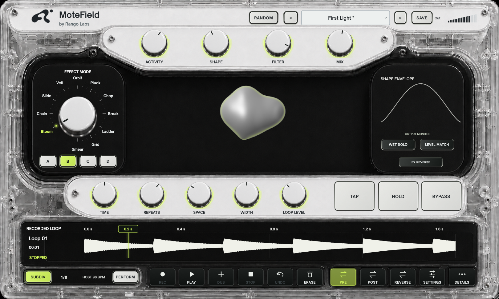

# MoteField by Rango Labs

MoteField turns incoming audio into layered micro loops, granular textures, rhythmic glitches, and spatial repeats. It combines **11 effect modes**, A-D variations, **32 factory presets**, and a **60-second phrase looper** in a compact hardware-style interface.

The clear enclosure, sculpted knob rails, and Acid lighting surround a pearl ferrofluid-inspired display. The floating fluid volume deforms, merges, and splits with processed sound and active voices; the adjacent Shape guide shows the grain envelope. Settings offers a custom accent color and dark mode, saved separately from sound presets.



**Current version: 0.3.6 development.** Available as universal macOS AU/VST3 and Windows x64 VST3 test builds. See [VERIFICATION.md](VERIFICATION.md) for checks and remaining host-specific validation.

## Included effects

Select an effect by turning the mode dial or clicking its name. The pointer aligns with the selected effect. A-D selects its variation, changing playback patterns, pitch behavior, or delay arrangements depending on the mode.

| Family | Effect | What it does |
| --- | --- | --- |
| Micro Loops | **Bloom** | Layers overlapping phrases at related playback speeds. Variations introduce upper octaves, lower octaves, or a cycling speed pattern for swelling, harmonically layered loops. |
| Micro Loops | **Chain** | Reads recent audio in a repeating slice sequence to build rhythmic phrases. Variations add half-speed and octave-related playback; D also introduces stepped amplitude quantization for a rougher texture. |
| Micro Loops | **Slide** | Bends the playback speed within each loop, creating rising, falling, or alternating pitch sweeps. Repeats extends the phrases and their overlap. |
| Granules | **Veil** | Scatters many small grains across recent audio to create a diffuse cloud. Variations range from slight detuning to wider pitch motion and octave layers. Shape also changes grain length. |
| Granules | **Orbit** | Overlaps long grains from different points in the recent capture, building sustained, slowly evolving textures. Variations include half-speed playback and pitch glides. |
| Granules | **Pluck** | Uses detected note attacks to choose where grains begin, keeping fragments connected to the articulation of the source. Variations add slight detuning or occasional octave-up voices. |
| Glitch | **Chop** | Replays short slices as rapid rhythmic cuts, with note attacks able to retrigger the pattern. Variations add changing playback speeds, octave steps, and a quantized texture. |
| Glitch | **Break** | Produces intermittent bursts with gaps between them. Activity changes the likelihood and rate of events; detected attacks can trigger fresh fragments. Variations change pitch and playback speed. |
| Glitch | **Ladder** | Steps individual fragments through repeating pitch-ratio sequences, using recent note attacks when available. Variations offer ascending, descending, octave, or reordered patterns; D adds amplitude quantization. |
| Multi Delay | **Grid** | Creates tempo-related stereo tap patterns. Activity changes the tap count, Repeats controls feedback, and A-D selects the timing arrangement. Grid uses a delay-tap view because Shape does not affect this mode. |
| Multi Delay | **Smear** | Blends multi-tap delay with granular playback and independently filtered taps. Variation B adds bandpass-style tap filtering; C adds octave-shifted taps. Shape changes modulation, smoothing, cross-feedback, and grain envelopes, turning distinct repeats into a more diffuse texture. |

### Shared processing

| Feature | What it does |
| --- | --- |
| **Filter / Resonance** | Rolls off high frequencies and emphasizes the region around the cutoff. |
| **Drift / Drift Rate** | Adds pitch modulation, with separate depth and speed controls in Details. |
| **Space** | Adds the selected reverb character to the effect signal. |
| **Bright reverb** | The least-damped, shortest-feedback reverb character. |
| **Dark reverb** | Stronger high-frequency damping for a darker tail. |
| **Hall reverb** | Longer feedback and greater stereo width for a larger space. |
| **Infinite reverb** | The longest-feedback and widest reverb character. Despite the name, its tail decays; use Hold to sustain captured material. |
| **FX Reverse** | Reverses effect playback. It is independent of the phrase looper's reverse control. |
| **Hold** | Stops replacing the recent capture while playback continues. In Grid and Smear, it captures and repeats the recent delay phrase. |
| **Width** | 0% mono, 100% original. Above 100%, a gentle curve caps added side gain at 10%, without delays or changing the mono sum. Width is printed into POST recordings; subsequent knob changes affect the live path, not the stored loop. PRE recordings remain upstream of the effects. Also changes the reactor’s horizontal spread. |
| **Wet Solo** | Auditions the fully wet live effect without changing Mix or writing the monitoring change into the looper. Existing POST recordings retain their recorded blend. |
| **Level Match** | Measures three seconds of input/output RMS, then holds compensation (up to ±12 dB). Relearns after main sound-control changes and waits for signal during silence. |
| **Mix / Output** | Blends dry and processed audio, then trims the effect output level. |
| **Bypass** | Smoothly returns to the unprocessed input while the engine and phrase transport continue running. |

## Main controls

| Control | Role |
| --- | --- |
| **Activity** | Changes event density, overlapping voice count, or delay tap count, depending on the mode. |
| **Shape** | Changes the volume contour of newly created grains. Also changes grain length in Veil and delay character in Smear. Not used by Grid. |
| **Filter** | Sets the low-pass cutoff. |
| **Mix** | Sets the dry/effect balance. |
| **Time** | Chooses a rhythmic subdivision when synced, or internal tempo in manual mode. |
| **Repeats** | Extends grain duration and feedback, or delay feedback, depending on the mode. |
| **Space** | Sets the reverb amount. |
| **Loop Level** | Sets the recorded phrase's contribution. |

Drag a knob vertically, scroll to adjust it, or double-click to reset it. Hold Shift while dragging for fine adjustment. Values appear on the knob; percentages use whole numbers.

**SUBDIV** follows host tempo when available, with an internal fallback. Switch to **TEMPO** for manual timing. Tap two or more times to set a manual tempo between 40 and 240 BPM. **Details** reveals modulation, resonance, output trim, reverb character, subdivision, loop speed, and Less Motion.

The window opens at 1000 x 645, or smaller to fit the screen. It is resizable, and opening Details stays within the existing window height.

## Phrase looper

Record up to 60 seconds and layer it independently of the selected effect.

| Control | Action |
| --- | --- |
| **Rec** | Start recording a phrase; press again to close the recording and play it. |
| **Play** | Finish recording or overdubbing, or resume a stopped phrase. |
| **Dub** | Start or finish an overdub pass. |
| **Stop** | Stop playback while retaining the phrase. |
| **Undo** | Remove the newest overdub pass, including a partial pass. |
| **Erase** | Clear the phrase and all overdubs. |
| **Pre / Post** | Place the looper before or after the effects. |
| **Loop Reverse** | Reverse phrase playback independently of FX Reverse. |
| **Loop Speed** | Play at half, normal, or double speed. Available in Details. |

**Recorded loop audio now saves with DAW projects and user presets.** Overdubs are mixed into the saved phrase; undo history is not serialized. Restoring at a different sample rate resamples the saved audio. Saving during an overdub takes a live snapshot; pause overdubbing first if you need an exact final take.

## Presets and automation

The preset menu has **Factory** and **User** submenus. Choose from 32 factory starting points covering all eleven modes, or use **Save** to name the current sound. Replacing an existing user preset requires confirmation. An asterisk marks changes from the selected preset, and its name is retained with the DAW session.

**Initialize sound** in the preset menu keeps the selected effect mode and loads a simple variation-A starting sound with modest Activity and Repeats, Mix at 40%, Width at 100%, and no added Space or Drift. Material, pitch, pattern and sidechain sound controls return to defaults. Timing/subdivision, output level, monitoring, Hold/Bypass, all looper settings, recorded audio, MIDI mappings and appearance are retained. The preset name becomes **Init - Orbit** (or the current mode). **Undo initialization** restores the previous sound and preset identity; loading, saving or randomizing a sound, or restoring a session, clears this one-step undo. Use **SAVE** to keep your initialized sound. POST recordings keep their captured sound; PRE recordings continue through the live effects.

**RANDOM**, beside the preset picker, creates a new sound across effect mode, variation, Activity, Shape, Filter, Mix, Repeats, Space, Drift, subdivision, reverb character, and FX reverse. It uses bounded starting ranges and sends parameter changes to the host. Recorded audio, looper settings, Hold, Bypass, tempo/sync, and output gain are retained. Click **SAVE** to keep the result as a user preset.

User presets are portable `.motefield` files stored in:

- macOS: `~/Library/Application Support/Rango Labs/MoteField/Presets`
- Windows: `%APPDATA%/Rango Labs/MoteField/Presets`

Use **Refresh user presets** after copying files into that folder. User presets save 49 sound, timing, routing, and performance settings, plus recorded phrase audio when present. Hold, Bypass, and transport gates are excluded. Presets containing a phrase replace the current phrase; sound-only presets retain it. Earlier version-1 preset files remain readable, with defaults for the new controls. Factory presets retain the current timing/sync and looper configuration.

All **61 exposed parameters** support host automation, including Mode, Variation, Hold, Bypass, and six looper command triggers. UI edits notify the host, allowing automation recording where the DAW supports it. Tap writes Tempo and Host Sync; display preferences are not audio parameters.

Looper triggers execute on each **0-to-1 or 1-to-0 transition**. Alternate values for repeated commands; a held value does not retrigger. Commands apply at the next processing block, and repeated edges of the same command within a block coalesce. Avoid simultaneous conflicting transport commands. DAW-specific automation behavior still needs host testing.

## Performance controls

Open **PERFORM** above the fluid display. Its three pages scroll within the existing plug-in window.

### Loop & Capture

- **Quantize loop:** arm record, play, overdub, or stop for the next quarter-note beat. With host sync enabled, timing uses the DAW's beat position. A host seek rebases an armed command. Changing tempo after recording does not time-stretch the phrase to the new tempo. Erase, Undo, and Burst remain immediate.
- **Continuous loop speed:** choose between the existing stepped speeds and a smooth 0.25–4x rate. Changing speed also changes pitch; this is varispeed, not pitch-preserving time stretch.
- **Loop fade:** choose a 0–10 second start/stop fade and in/out direction.
- **Looper only:** bypass granular rearrangement while retaining the filter, pitch modulation, and reverb.
- **Close recording into:** choose playback or immediate overdubbing.
- **Hold to capture Burst:** recording lasts while the button is pressed, then plays on release. Another press replaces the phrase. The Burst gate is also automatable.
- **Bypass trails:** stop feeding new audio, release Hold, fade the phrase, and let effect tails decay while dry audio passes through.
- **Hold behavior:** toggle or momentary operation for the main Hold pad.
- **Capture 1 / 2 / 4 bars:** replace the phrase with the most recent processed output. The rolling history holds up to 32 seconds and uses the host time signature when available. Early captures contain only the audio received so far; capture ends at the click, not at the previous bar line.
- **Export / Drag Loop WAV:** click to save a stereo 24-bit WAV, or drag it onto a compatible DAW track. Dragged exports remain in the MoteField `Exports` folder beside `Presets`, so a project can continue referencing them.

### Material & Magnet

The fluid display controls real playback. Drag horizontally to scan older captured audio and vertically to transpose by up to two octaves. Shift-drag changes grain duration; Alt-drag adds voices. Double-click resets the gesture. Each gesture records host automation.

| Control | Audible behavior |
| --- | --- |
| **Viscosity** | Slows the response of capture position, transposition, and stretch; also slows the display's settling. |
| **Cohesion** | Narrows or spreads voice/tap panning and gathers or separates visual bodies. |
| **Tension** | Sharpens grain envelopes; in delay modes it changes tap filtering. |
| **Capture position** | Reads further back into the available audio history. |
| **Field pitch** | Transposes grains or pitch-shifts delay taps. |
| **Grain stretch** | Extends grain envelopes; changes tap spacing in delay modes. |
| **Split voices** | Adds grains or taps within the engine's bounded voice limits. |

Enable the mono **Magnet** sidechain bus in your DAW and feed another track into it. **Compress** ducks and tightens the processed texture, **Trigger** launches granular events when the follower crosses its threshold, and **Attract** gathers the voices' stereo positions. Amount, attack, and release are adjustable. Trigger applies to granular modes; Grid remains a tapped delay. With no sidechain input, the magnet has no external signal to follow.

The surface remains a ferrofluid-inspired interpretation with damped motion, not a physical magnetic-fluid simulation. Its gestures control the field as a whole.

### Pattern & MIDI

**Pattern seed** reproduces the engine's random choices from the same input and starting timeline position. **Lock pattern** repeats its sequence of choices over 1–64 events and suppresses input-onset retriggering. It does not freeze source audio. **Mutate rhythm** changes event spacing/probability; **Mutate pitch** adds repeatable pitch intervals independently. Delay modes mutate tap spacing and pitch.

Choose **Source note**, **Scale root**, and a major, minor, or pentatonic scale to constrain grain transpositions. Source note is set manually; this does not detect and retune every note in polyphonic audio. Sweeps can travel between the constrained endpoints. Grid's delay taps do not use the grain scale controls.

Select a parameter and click **Learn next MIDI CC**, then move a controller. Mappings save with the DAW project. Defaults: CC1 controls Drift depth, CC11 controls Mix, and CC64 controls Hold. Transport CCs act on a rising press and ignore release, while the Burst gate records until released. MIDI CC events are applied at their sample offsets. Program changes 1–32 select factory presets through the message-thread preset loader, so preset changes are not sample-accurate. Host automation remains available independently of MIDI routing.

## Audio-reactive display

Bass energy changes the main body's pressure and stretch, mids alter its contour, and treble adds localized surface tension. Active voices form persistent groups whose position and shape follow grain phase, pan, envelope, playback rate, and audio samples. Groups merge through a shared surface instead of covering one another. The material and logo settle when the signal stops.

The Shape guide uses the same envelope mapping as the audio engine. Moving markers show active grains; existing grains can retain their earlier envelope until they finish. Grid shows its actual delay taps instead. **Less Motion** reduces spatial movement and holds the logo still.

The display is a visual interpretation of the sound. Rendering runs on the UI thread using bounded buffers; audio processing publishes snapshots without waiting for painting.

## Build and install

The project uses C++20, CMake 3.22+, Git, and a pinned JUCE dependency fetched during configuration. Mono-to-mono and stereo-to-stereo processing are supported.

### macOS

Install full Xcode and select it as the active developer directory, then run:

```sh
bash scripts/build-macos.sh
# Close your DAW before replacing a loaded plug-in.
bash scripts/install-macos.sh
```

The script builds universal Apple Silicon/Intel VST3 and AU bundles, runs the DSP tests, and stages locally signed development bundles in `dist/macos`. Installation backs up previous copies and uses:

- `~/Library/Audio/Plug-Ins/VST3/MoteField.vst3`
- `~/Library/Audio/Plug-Ins/Components/MoteField.component`

Reopen your DAW, enable VST3/AU scanning, and rescan if needed. Load MoteField on an audio track receiving a signal. Start with **First Light**, raise Mix, and try Hold on a sustained chord.

For private Mac testing without a notarized installer, run `bash scripts/package-friend-macos.sh`. The ZIP includes both plug-ins, a per-user installation script, and `START HERE.txt`. The script verifies the files and clears download quarantine only on its newly installed MoteField copies. It does not change global security settings.

Create a development installer with `bash scripts/package-macos.sh --unsigned`. See [release preparation](RELEASE.md) for signed distribution.

### Windows

Use Visual Studio with Desktop development with C++, CMake, and Git. From a developer terminal:

```powershell
./scripts/build-windows.ps1
./scripts/package-friend-windows.ps1
# Optional .exe installer:
./scripts/package-windows.ps1 -Unsigned
```

The direct-install ZIP packages the Windows VST3, checksums, `Install.cmd`, `Install.ps1`, and `START HERE.txt`. Extract it, quit the DAW, run `Install.cmd`, and approve the administrator prompt. The script checks the payload and backs up an older MoteField copy before installing in the standard system VST3 folder. A manual-copy alternative is documented in the ZIP.

Packaging uses PowerShell 7; the optional `.exe` also requires Inno Setup 6.3 or newer. The installer targets `C:\Program Files\Common Files\VST3\MoteField.vst3` and includes an uninstaller. Windows x64 builds and installers are configured in [GitHub Actions](.github/workflows/build.yml); native Windows DAW testing remains pending.

### Linux

Install the JUCE platform dependencies for X11, ALSA, OpenGL, FreeType, and fontconfig, plus CMake and a C++20 compiler:

```sh
cmake -S . -B build -DCMAKE_BUILD_TYPE=Release
cmake --build build --parallel 2
ctest --test-dir build --output-on-failure
```

Artifacts are under `build/MoteField_artefacts/Release`. Linux VST3 bundles can be installed in `~/.vst3/`. Platform binaries are not interchangeable.

## Tests and release status

The DSP suite covers all mode/variation combinations, buffer-size determinism, Hold, layered overdubbing and undo, output telemetry, frequency-band response, oversized buffers, and allocation-free processing in the instrumented callback test.

An optional native editor harness checks presets, automation notifications, mode-pointer alignment, value formatting, window sizing, material response, and silence settling:

```sh
cmake -S . -B build -DMOTEFIELD_BUILD_PREVIEW=ON -DCMAKE_BUILD_TYPE=Release
cmake --build build --target MoteFieldPreview --config Release --parallel 2
# Executable location depends on the CMake generator.
./build/MoteFieldPreview /absolute/path/to/preview-output --stills-only
```

See [verification](VERIFICATION.md) for completed checks and remaining platform testing. High feedback and stacked loops can exceed full scale; Output controls the effect path and Loop Level controls the phrase contribution. Direct MIDI routing and external audio dragging depend on host support. The AU retains its original effect identity for existing projects; MIDI-controlled operation is best tested with VST3 in hosts that route MIDI to audio effects.

## License

Original source is available under the [MIT License](LICENSE). JUCE and its bundled dependencies retain their own licensing terms. Open Sauce Sans font notices are included in [Assets/OFL.txt](Assets/OFL.txt).

### Appearance

Acid is the default accent on the neutral light enclosure. Open **Settings** to switch **Dark mode** on or off, choose a color with the picker/RGB sliders, or enter a six-digit hex color. **Reset to Acid** restores the accent without changing the light/dark setting.

The accent follows knob light rings, selected controls, the recorded-loop playhead, and audio-reactive silver-fluid reflections. Labels use contrasting neutral colors. Appearance is saved on this computer separately from sound presets and DAW automation; open instances in the same plugin process update together. The recorded-loop waveform remains visible on its dedicated lower strip.
